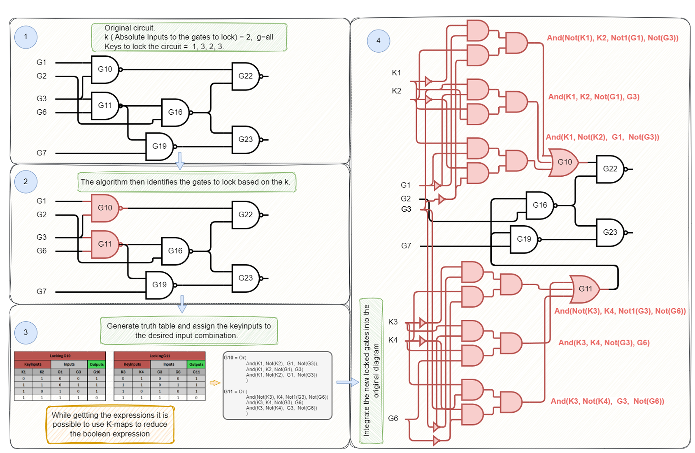

<!-- This file should be generated by Research Paper under ./Papers/ -->
# K-Gate Lock: Multi-Key Logic Locking Using Input Encoding
This repository contains resources related to K-Gate Lock logic locking scheme. </br>
[Kevin Lopez](https://github.com/KevinDLopez) & [Amin Rezaei](https://github.com/r3zaei) </br>

## File Structure
The file structure is organized as follows:

- **Tools** - Tools used to test the algorithm:
  - **RANE** - Tool used to perform attacks on encrypted circuits.
  - **NEOS** - Tool used to perform attacks on encrypted circuits.
  - **ABC** - Tool used to convert Verilog, BLIF, and BENCH files.

- **src** - The source code for encrypting and testing the algorithm:
  - **test_runs** - Contains the previously run algorithms. The folder name matches the configuration run. 
    - Example: `k_2____MaxGates_10____5bits` locked 10 gates with level 2 and 5-bit key size.
  - **PowerMeasurement** - The Xilinx Vivado project used for power measurement.
  - **help_scripts** - Contains scripts to convert BLIF and Verilog files using abc.
  - **Other Files** - Used for the implementation of the algorithm.

## Understanding the Algorithm
The K-Gate Lock logic locking scheme secures digital circuits by adding gates that require specific keys to function. The process is illustrated below:



1. **Original Circuit**: Get the inputs from the user on how to lock the circuit.
   -  Identify the circuit to be locked.
   -  `k` to lock, `g` to lock  
   -  `keys` required.
2. **Gate Selection**: The algorithm selects gates to lock based on the given `k`.
3. **Key Integration**: Generate the truth table and assign key inputs to achieve the desired input combination. Use K-maps to simplify boolean expressions.
4. **Encryption**: Integrate the locked gates into the original circuit, making the circuit dependent on the keys for correct functionality.

For a deeper explanation, refer to the [paper](https://github.com/cars-lab-repo/KGL/blob/main/paper/K-Gate%20Lock%20Multi-Key%20Logic%20Locking%20Using%20Input%20Encoding%20Against%20Oracle-Guided%20Attacks.pdf).

## Running the Algorithm
Before running any help script, ensure the following steps are completed:

1. **Install Dependencies**:
   - Using Linux, install the following tools:
     - [NEOS](https://bitbucket.org/kavehshm/neos/)
     - [Yosys](https://github.com/YosysHQ/yosys.git)
     - [ABC](https://github.com/berkeley-abc/abc.git)
     - [RANE](https://github.com/gatelabdavis/RANE.git)
   - Additionally, install [Python](https://www.python.org/downloads/) and [PyEDA](https://pyeda.readthedocs.io/en/latest/install.html).

2. **Navigate to the src Folder**:
   - Run the following command to navigate inside the `src` folder:
     ```bash
     cd <project_dir>/src/
     ```

### Encrypting a BENCH File 
To encrypt a BENCH file, simply run the main.py file with a file to encrypt, keys, and k (NOTE: python, PyEda need to be installed)
- `python3 main.py "./src/benchmarks/iscas85/c17.bench" --key_values="3 4 5" --k=2`

### Testing Algorithm
To test the algorithm in a single file, run the test_bench_file.sh using Linux ( NOTE: NEOS, python, and PyEda need to be installed)
  - `./test_bench_file.sh ./benchmarks/iscas85/c17.bench --keys="3 4 5" --k=2`

  This command will generate the encrypted file (run the python script motioned in 'Encrypting a BENCH file'), then run NEOS with SAT solver.

#### Testing a Whole Folder
to perform a batch test, run the `./test_folder.sh` file with the following positional 
- Folder path: Where are the files located
- keys: keys to test with example "3 4 5"
  - Key1 = 3  or 011
  - Key2 = 4  or 001
  - Key3 = 5  or 101
- k: number of inputs that the locked gate needs to have 

Example of a command:
- `./test_folder.sh  ./benchmarks/iscas85  "5 5 5" 2`

## Citation
```
@INPROCEEDINGS{KGL,
  author={Lopez, Kevin and Rezaei, Amin},
  booktitle={Proceedings of 30th Asia and South Pacific Design Automation Conference (ASP-DAC)}, 
  title={K-Gate Lock: Multi-Key Logic Locking Using Input Encoding Against Oracle-Guided Attacks}, 
  year={2025},
  volume={},
  number={},
  pages={},
  doi={10.1145/3658617.3697764}
  }
```

## License
This project is licensed under the MIT License - see the [LICENSE](LICENSE) file for details.

<!-- ## Contact
For questions or contributions, please contact:
- Kevin Lopez: [kevin@example.com](mailto:kevin@example.com)
- Amin Rezaei: [amin@example.com](mailto:amin@example.com) -->
